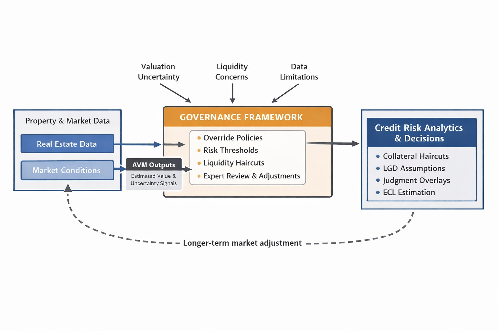

## Abstract 

Automated valuation models (AVMs) are widely used in property-backed lending to support collateral valuation and credit risk assessment (Crosby, 2000; International Valuation Standards Council (IVSC), 2020). While prior research has examined AVM accuracy, bias and predictive performance, less attention has been paid to how valuation uncertainty generated by AVMs is incorporated into institutional credit risk decisions (French and Gabrielli, 2018).  

I am proposing via this paper a conceptual framework positioning **valuation governance** as the institutional transmission mechanism linking AVM outputs to downstream credit risk analytics, including loan-to-value (LTV) calibration, loss given default (LGD) assumptions and expected credit loss (ECL) estimation (Basel Committee on Banking Supervision, 2017; European Banking Authority (EBA), 2017).  

This framework is explicitly situated at the domain level of governance within credit processes. It therefore does not attempt to diagnose macroeconomic regime shifts or enterprise-level capital strategy decisions. Domain-level governance may, however, generate signals or escalation findings that inform enterprise-level deliberations where appropriate and, it explains how valuation governance disciplines the application of collateral values in lending decisions and defines escalation pathways where valuation uncertainty exceeds defined tolerance thresholds.

The framework further suggests that the intensity of valuation governance increases in conditions characterised by market illiquidity, asset heterogeneity, or elevated valuation frequency relative to observable transaction evidence, where the signal-to-noise ratio in automated estimates is likely to deteriorate (French and Gabrielli, 2018; International Valuation Standards Council (IVSC), 2020; Basel Committee on Banking Supervision, 2017).

## Keywords

Automated Valuation Models (AVMs), Valuation Governance, Credit Risk Analytics, Loan-to-Value (LTV), Property-Backed Lending, Data-Constrained Markets

## 1. Introduction

Property markets differ markedly in liquidity, transparency and data depth across segments. Certain owner-occupied residential markets in mature jurisdictions may exhibit relatively high transaction volumes and observable price formation. By contrast, commercial property markets, specialised assets and thinly traded sub-segments often rely on episodic transactions, negotiated pricing and appraisal-based evidence. Even within liquid residential markets, valuation reliability may vary across locations and property types. These structural variations in market evidence and price discovery generate persistent valuation uncertainty, particularly where comparable data are sparse or heterogeneous (French and Gabrielli, 2018).

Within credit risk frameworks, collateral values influence LTV ratios, LGD assumptions and ECL estimation under prudential and accounting regimes (Basel Committee on Banking Supervision, 2017; IASB, 2014). In practice, AVM outputs are not to be mechanically inserted into risk systems. They are interpreted, constrained and operationalised through institutional governance processes (EBA, 2017).  

This paper addresses the gap between valuation technology and credit risk application by conceptualising valuation governance as the mediating institutional layer. Yet the difficulty is not purely technical. Collateral valuation appears procedural, but its consequences are institutional.
While valuation standards and credit risk frameworks acknowledge collateral uncertainty (Basel Committee on Banking Supervision, 2017; European Banking Authority (EBA), 2017; International Valuation Standards Council (IVSC), 2020), the institutional mechanisms through which valuation governance shapes credit outcomes have not been systematically conceptualised within the credit risk literature.

To clarify this conceptual gap, Figure 1 presents a high‑level framework illustrating how uncertainty associated with AVM outputs is mediated through institutional governance before influencing downstream credit risk analytics. The figure is intended as an organising device rather than a process model, previewing the institutional logic developed in the sections that follow.

{#fig:governance width=90%}

The components and pathways depicted in Figure 1 are examined in detail in Sections 3 and 4, where the paper develops the argument that governance structures shape how valuation uncertainty is recognised, constrained, and acted upon within property-backed lending.

## 2. Related Literature and Conceptual Positioning

This paper is situated at the intersection of three bodies of literature that are typically examined in isolation: automated valuation models (AVMs), collateral valuation within credit risk analytics, and governance in financial risk management (Crosby, 2000; Basel Committee on Banking Supervision, 2017). While each strand has developed substantially, their integration remains limited with respect to the treatment of valuation uncertainty in institutional decision‑making.

The AVM literature has largely focused on predictive accuracy, bias, and model performance relative to traditional appraisal methods (Crosby, 2000; French and Gabrielli, 2018). Although recent studies acknowledge valuation uncertainty and error dispersion, particularly in heterogeneous or illiquid property markets, this uncertainty is typically framed as a modelling limitation rather than an institutional challenge (French and Gabrielli, 2018).

In parallel, the credit risk literature recognises the importance of collateral values for loan‑to‑value calibration, loss given default assumptions, and expected credit loss estimation in property‑backed lending (Basel Committee on Banking Supervision, 2017; IASB, 2014). However, valuation inputs are often treated as exogenous, abstracting from how estimates are produced and governed in practice. Empirical work on IFRS 9 implementation, for example, documents substantial cross‑institutional variation in how banks incorporate forward‑looking information, collateral haircuts, and margins of conservatism into expected credit loss estimates, with governance and judgemental overlays playing a central role (European Banking Authority (EBA), 2017).

A third strand examines governance, judgement, and model risk management within financial institutions, emphasising oversight structures, expert review, and accountability mechanisms (EBA, 2017; Board of Governors of the Federal Reserve System and Office of the Comptroller of the Currency, 2011). While this literature highlights the importance of governance in constraining model use, it rarely engages explicitly with valuation processes or real‑estate‑specific features such as illiquidity and non‑fungibility (IVSC, 2020). Macroprudential analyses of real‑estate cycles further stress the role of collateral valuations in amplifying credit booms and busts (Borio, Furfine and Lowe, 2001), but typically do not unpack the internal governance mechanisms through which valuation signals are transmitted into credit terms.

This paper bridges these strands by positioning valuation governance as the institutional transmission mechanism between AVM‑related uncertainty and credit risk decisions.

## 3. Valuation Governance in Property-Backed Lending

Valuation governance refers to the institutional policies, controls, and oversight mechanisms that shape how valuation information is produced, reviewed, and applied within financial institutions. In property‑backed lending, these mechanisms play a critical role in delimiting quantitative and procedural reliance on automated outputs and ensuring that valuation uncertainty is appropriately considered in credit decisions (IVSC, 2020; French and Gabrielli, 2018).

We distinguish three broad categories of valuation governance mechanisms:

- **Policy-based controls** (eligibility thresholds, haircuts, escalation triggers)  
- **Expert-based review** (override scrutiny, committee review)  
- **Analytics-based overlays** (liquidity adjustments, dispersion monitoring)

These mechanisms respond to structural features of property markets—such as illiquidity, asset heterogeneity, and imperfect price discovery—that limit the effectiveness of purely automated valuation approaches (French and Gabrielli, 2018; IVSC, 2020). 

These structural limitations become particularly salient in data-constrained markets where automated valuation outputs may substitute statistical continuity for transactional depth.

## 4. Valuation Governance in Data-Constrained Markets

In transaction-sparse and structurally illiquid property markets, AVMs enhance informational continuity by imputing values across time and space, effectively increasing the apparent signal-to-noise ratio of collateral data. Yet this statistical enhancement is not neutral. Empirical research in real estate finance demonstrates that appraisal-based and model-based valuations exhibit smoothing and lag effects relative to transaction prices (Geltner, 1993; Geltner et al., 2014). By smoothing valuation paths and reducing observed volatility, AVMs may stabilise lending metrics while masking latent fragility, thereby potentially contributing to pro-cyclical credit dynamics within the financial system (Borio, 2003). These dynamics raise the question of where, institutionally, corrective discipline is applied.
It is important to distinguish enterprise-level model risk governance from domain-specific valuation governance. Enterprise governance establishes institution-wide standards for model validation, documentation, and independent review (Board of Governors of the Federal Reserve System, 2011). However, the differentiation between genuine market information and model-imposed continuity in thin property markets occurs primarily at the domain level, embedded within collateral management and credit risk functions. 

Domain-level governance—under enterprise-defined limits—determines update frequency, liquidity overlays, override thresholds, and valuation admissibility into LTV, LGD, and ECL. Thus, while enterprise governance disciplines model legitimacy, domain governance operationalizes it in credit decision processes.

## 5. Governance as an Institutional Transmission Mechanism

AVM outputs are mediated through governance structures before influencing LTV, LGD or ECL parameters (Basel Committee on Banking Supervision, 2017). Governance absorbs uncertainty through eligibility criteria, overrides and conservative adjustments. This does not eliminate valuation uncertainty; it renders it decision-relevant.

The core governance challenge is not detecting market turning points, but deciding when the reliability of valuation evidence has deteriorated sufficiently to warrant institutional restraint.

### 5.1 Residential Mortgage Illustration (Domain Governance Framing)

In residential portfolios, transaction activity may decline, financing conditions may tighten and inventory levels may increase, altering local market indicators. AVM outputs may display wider confidence intervals or greater dispersion relative to realised transactions. Confidence can widen before values visibly fall.

The governance question is not whether the market has entered a structural regime shift, but whether valuation evidence remains sufficiently reliable for automated application without additional controls. Governance responses may include tightening AVM eligibility criteria, increasing override scrutiny, applying conservative collateral adjustments or escalating observations to enterprise committees where appropriate (Basel Committee on Banking Supervision, 2017; EBA, 2017; IVSC, 2020). 

Valuation governance therefore manages uncertainty within credit processes rather than diagnosing broader market conditions.

### 5.2 Commercial Property Illustration (Domain Governance Framing)

In commercial segments, declining transaction volumes or reduced transparency may widen valuation dispersion. Governance mechanisms assess whether automated outputs remain fit for use within credit decisions or require enhanced review or temporary restriction.

For both residential and commercial portfolios, domain-level valuation governance does not determine enterprise strategy directly. Rather, it generates structured signals—such as escalation trends, override concentrations, dispersion metrics, and liquidity-adjusted haircuts—that may inform enterprise-level deliberations on credit policy, capital planning, and risk appetite (Basel Committee on Banking Supervision 2017; European Banking Authority 2017; Board of Governors of the Federal Reserve System and Office of the Comptroller of the Currency 2011). Domain governance thus operates as an informational filter: it translates valuation uncertainty into institutionally interpretable indicators that can be considered at higher decision layers without collapsing the distinction between operational control and strategic oversight.

### 5.3 Propositions

Where uncertainty exceeds tolerance thresholds, escalation beyond valuation functions may occur. However, valuation governance remains responsible for disciplined treatment of collateral inputs within lending processes (EBA, 2017; IVSC, 2020).

Credit risk analytics and decisions emerge downstream of this process. Loan‑to‑value calibration, loss given default assumptions, expected credit loss estimation, and capital allocation are shaped by governance‑mediated valuation inputs rather than raw AVM outputs (Basel Committee on Banking Supervision, 2017). This structure helps explain why similar valuation technologies can yield materially different credit outcomes across institutions and markets, depending on how governance frameworks are designed and enforced.

Finally, the framework incorporates a weak and indirect feedback channel from credit risk decisions back to property and market data as illustrated in Figure 1. This reflects longer‑term market adjustment effects—such as changes in lending standards, credit availability, and risk appetite—rather than a direct or immediate feedback loop (Borio, Furfine and Lowe, 2001).

The conceptual framework implies several propositions that can be examined empirically:

**Proposition 1 (Governance intensity and collateral conservatism).**  
Institutions that apply more stringent policy‑based valuation governance—such as higher mandatory liquidity haircuts and tighter eligibility criteria for AVM use—will exhibit lower average loan‑to‑value ratios for exposures in illiquid or data‑constrained property markets, conditional on similar AVM technologies and borrower risk profiles.

**Proposition 2 (Expert oversight and loss realisation).**  
Institutions with stronger expert‑based valuation governance—such as systematic second‑line review of high‑risk or atypical properties—will display lower realised loss given default on property‑backed exposures than institutions that rely predominantly on unchallenged AVM outputs, holding portfolio mix constant.

**Proposition 3 (Analytics‑based controls and ECL sensitivity).**  
The use of data/analytics‑based valuation controls—such as dynamic liquidity haircuts and performance‑based margins of conservatism—will be associated with expected credit loss estimates that respond more strongly to changes in market liquidity indicators than in institutions without such controls.

**Proposition 4 (Governance heterogeneity and cross‑institutional dispersion).**  
Cross‑institutional differences in valuation governance regimes will account for a non‑trivial share of the observed variation in LTV, LGD, and ECL metrics across lenders operating in the same property markets, even when they use similar AVM vendors and regulatory frameworks.

**Proposition 5 (Supervisory amplification under AI-augmented valuation).**
During market downturns characterised by limited transactions and falling prices, supervisory scrutiny may prompt institutions to reassess the reliability of AI-augmented valuation signals—particularly where synthetic comparables or compressed confidence intervals give an appearance of stability. In such contexts, external oversight can act as a reinforcing mechanism, intensifying valuation governance and restoring collateral conservatism in loan-to-value calibration.

## 6. Implications for Credit Risk Analytics

Valuation uncertainty influences LTV calibration, LGD assumptions and ECL estimation (Basel Committee on Banking Supervision, 2017; IASB, 2014). Governance frameworks determine how conservatism is applied through overrides, haircuts and escalation procedures.

Indicators for supervisory assessment may include the following, though these are illustrative rather than exhaustive:

- Frequency and magnitude of overrides  
- Liquidity haircut distributions  
- Dispersion between AVM outputs and realised prices  
- Escalation rates under uncertainty conditions  

These indicators are imperfect proxies. They do not measure market truth; they measure institutional response to uncertainty. That distinction matters for governance design. These dynamics are particularly salient in data-constrained environments where valuation outputs are generated more frequently than observable transactions.
In transaction-thin markets, AVM outputs may convey a degree of numerical precision that exceeds the informational depth of underlying transactions. Model-derived confidence measures can create an appearance of certainty even when market liquidity is deteriorating. Governance mechanisms are therefore critical in counteracting false precision by incorporating liquidity overlays, conservative margins, and expert challenge into collateral assessment processes.

## 7. Conclusion

This paper develops a conceptual framework that positions valuation governance as the institutional mechanism through which uncertainty generated by automated valuation models is incorporated into credit risk decision-making. By bridging the automated valuation, credit risk, and governance literatures, the framework explains how valuation uncertainty is managed in practice rather than assuming a mechanical transmission from model outputs to risk metrics. It highlights how governance structures shape the interpretation, constraint, and documentation of valuation information before it influences collateral valuation, loss modelling, and downstream credit risk analytics.
By clarifying governance’s role at the domain level within credit processes, the analysis distinguishes valuation governance from enterprise-level risk governance and demonstrates how institutional design conditions the admissibility of model outputs into LTV, LGD, and ECL calculations. The institutional risk is therefore not model error alone, but misplaced confidence in automated outputs when supporting evidence becomes thin.
The contribution is timely given expanding AVM deployment and increasing supervisory scrutiny of model-based risk assessment (Basel Committee on Banking Supervision, 2017; EBA, 2017).

From a policy and practice perspective, the framework is relevant for multiple stakeholders. Regulators may use it to assess whether governance arrangements adequately mediate reliance on automated valuation tools within supervisory and accounting regimes. Lenders may apply it to strengthen internal credit policies, escalation protocols, and risk controls surrounding collateral valuation. Valuation firms and service providers may use it to align automated valuation practices with institutional expectations around judgement, documentation, and accountability (IVSC, 2020).

Future research may extend this framework through empirical examination of governance practices across institutions, for instance by testing the propositions developed above using multi-bank datasets, supervisory information, or cross-country comparisons. It may also explore how changes in data availability and market liquidity interact with existing governance arrangements to shape the pro-cyclicality of collateral-based lending (Borio, Furfine and Lowe, 2001).

## Acknowledgement
I am grateful to Dr. Anam Fatima for her guidance and constructive feedback during the development of this research. I also thank Mr. Sanjay Gupta for valuable industry insights and discussions that helped refine aspects of the conceptual framework. Any remaining errors or interpretations are entirely my own.

## Disclaimer
This paper represents my independent academic research. The views and interpretations expressed are solely my own. Generative AI tools were used only for language refinement and text polishing during manuscript preparation. All analysis, conceptual development and conclusions remain the author’s responsibility.

## References

Basel Committee on Banking Supervision (2017) *Guidelines on credit risk and accounting for expected credit losses*. Basel: Bank for International Settlements. Available at: https://www.bis.org/bcbs/publ/d350.htm (Accessed: [26 Feb 2026]).

Board of Governors of the Federal Reserve System and Office of the Comptroller of the Currency (2011) *Supervisory guidance on model risk management (SR 11-7)*. Washington, DC: Federal Reserve System. Available at: https://www.federalreserve.gov/supervisionreg/srletters/sr1107a1.pdf (Accessed: [26 Feb 2026]).

Borio, C. (2003) *Towards a macroprudential framework for financial supervision and regulation?* BIS Working Paper No. 128. Basel: Bank for International Settlements. Available at: https://www.bis.org/publ/work128.htm (Accessed: [26 Feb 2026]).

Borio, C., Furfine, C. and Lowe, P. (2001) *Pro-cyclicality of the financial system and financial stability: issues and policy options*. BIS Papers No. 1. Basel: Bank for International Settlements. Available at: https://www.bis.org/publ/bispap01.htm (Accessed: [26 Feb 2026]).

Crosby, N. (2000) ‘Valuation accuracy, variation and bias in the context of standards and expectations’, *Journal of Property Research*, 18(2), pp. 130–161.4 https://doi.org/10.1108/14635780010324240

European Banking Authority (EBA) (2017) *Guidelines on credit institutions’ credit risk management practices and accounting for expected credit losses (EBA/GL/2017/06)*. Paris: European Banking Authority. Available at: https://www.eba.europa.eu/regulation-and-policy/credit-risk/guidelines-on-credit-institutions-credit-risk-management-practices-and-accounting-for-expected-credit-losses (Accessed: 26 February 2026).

French, N. and Gabrielli, L. (2018) ‘Uncertainty in valuation: A framework for analysis’, *Journal of Property Investment & Finance*, 36(3), pp. 231–247. Available at: https://doi.org/10.1108/14635780410569470

Geltner, D. (1993). Estimating Market Values from Appraised Values without Assuming an Efficient Market. Journal of Real Estate Research, 8(3), 325–345. https://doi.org/10.1080/10835547.1993.12090713

Geltner, D., Miller, N., Clayton, J. and Eichholtz, P. (2014) *Commercial Real Estate Analysis and Investments*. 3rd edn. Mason, OH: Cengage Learning.

International Accounting Standards Board (IASB) (2014) *IFRS 9 Financial Instruments*. London: IFRS Foundation. Available at: https://www.ifrs.org/issued-standards/list-of-standards/ifrs-9-financial-instruments/ (Accessed: [26 Feb 2026]).

International Valuation Standards Council (IVSC) (2020) *International Valuation Standards*. London: IVSC. Available at: https://www.ivsc.org/standards/international-valuation-standards (Accessed: [26 Feb 2026]).

Reite, E.J. (2023) ‘Mortgage lending valuation bias under housing price changes and loan-to-value regulations’, *Finance Research Letters*, 58, Article 104677. doi:10.1016/j.frl.2023.104677.

